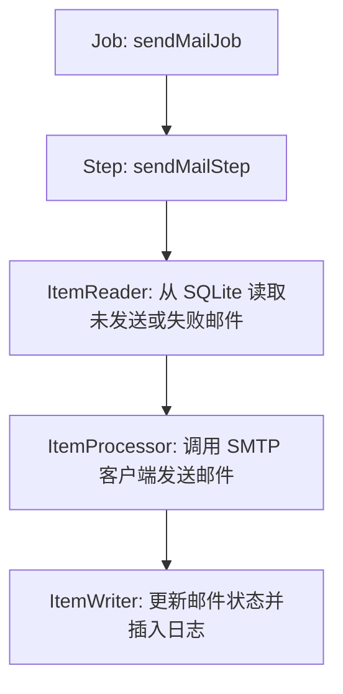

# 场景 1 入门指南：使用 Spring Batch 批处理计划任务

本指南旨在向您详细解释和说明 **场景 1：使用 Spring Batch 批处理计划任务** 的设计、架构及执行逻辑，帮助您快速理解本工程中批处理模块的实现方式。

---

## 📖 1. 什么是 Spring Batch 批处理？

**Spring Batch** 是 Spring 框架中专门用于处理**大批量、离线、周期性数据处理**的轻量级批处理框架。
在本演示系统中，Spring Batch 被用来执行“**批量扫描数据库并发送邮件**”的任务。相较于单封邮件的即时发送，批处理特别适合用于：
- 每日/每小时的例行账单发送、系统通告邮件发送等。
- 采用数据块（Chunk）处理模式，在发生网络闪断或单封发送失败时，具有出色的事务控制和日志追踪能力。

---

## 🏗️ 2. 核心组件设计与工作流

批处理的核心是 **Job (作业)** 与 **Step (步骤)**。在 [MailBatchConfig.java](../src/main/java/com/feilonglab/springboot/batch/sendmail/MailBatchConfig.java) 中，我们定义了一个邮件发送作业：



### 1) Job & Step 结构
- **Job (`sendMailJob`)**：表示整个批处理生命周期，包括启动、执行参数验证、监控运行状态并输出最终结果。
- **Step (`sendMailStep`)**：Job 下的具体执行步骤。我们配置了 **Chunk 模式**。
  - **什么是 Chunk(1) 模式？**
    即**每处理 1 封邮件，执行一次数据库提交**。这是本项目中针对 SQLite 数据库的重要设计：SQLite 是一个文件级锁数据库，大事务会锁死整个数据库。通过 Chunk(1) 事务拆分，每封邮件都在独立的短事务中提交，确保快速释放数据库文件锁。

### 2) 批处理三阶段组件
- **ItemReader (`mailItemReader`)**：
  - **功能**：通过 Doma ORM 框架的 `MailInfoDao` 检索数据库中 `status = 0` (未发送) 或 `status = 9` (发送失败且重试次数 `< 3`) 的邮件。
  - **实现**：采用 `@StepScope` 动态作用域，确保每次任务运行时都会重新向数据库发起最新状态查询，提供一条条数据供后续处理。
- **ItemProcessor (`mailItemProcessor`)**：
  - **功能**：处理单条邮件实体。
  - **逻辑**：针对每一封邮件，创建一个独立的 `SmtpClient` 连接，并通过 SMTP 发送。如果发送成功，设置邮件状态为成功并记录发送时间；如果发送异常（如网络中断），捕获异常，将状态标记为失败，并截取前 500 个字符的错误信息。最后将处理结果封装在 `MailProcessingResult` 中传给 Writer。
- **ItemWriter (`mailItemWriter`)**：
  - **功能**：持久化处理结果。
  - **逻辑**：在 Step 的 Chunk 事务中，更新 `mail_info` 表中的邮件状态，并向 `mail_send_log` 表插入一条包含本次发送次数、耗时和具体报错原因的流水日志。

---

## 💻 3. 双重运行模式

本项目为场景 1 提供了两种灵活的触发运行方式，分别适用于运维管理和 Web 交互：

### 模式 A：命令行触发模式（推荐用于计划任务调度）
在生产环境或运维自动化中，通常使用系统的计划任务（如 Linux Crontab、Windows 计划任务）定期执行命令行命令启动程序。
我们编写了 [BatchCommandLineRunner.java](../src/main/java/com/feilonglab/springboot/batch/sendmail/BatchCommandLineRunner.java)：
- **工作原理**：它实现 Spring Boot 的 `CommandLineRunner` 接口。在应用启动时，它会扫描传入的命令行参数。
- **命令行参数**：`--run-batch-job` 或 `--run-batch-job=sendMailJob`。
- **生命周期**：
  1. 如果检测到命令参数，程序**不会**完全运行 Web 容器，而是同步执行 `sendMailJob`。
  2. 运行结束后，它会根据任务状态，调用 `System.exit(0)`（成功）或 `System.exit(1)`（失败）安全地退出 JVM，回收所有内存。
  3. 如果未检测到参数，应用则像普通的 Web 应用一样保持在后台运行。
- **如何在本地命令行运行**：
  ```bash
  # Windows 终端运行默认的 sendMailJob 批处理并退出 JVM
  .\mvnw.cmd spring-boot:run -Dspring-boot.run.arguments="--run-batch-job"
  ```

### 模式 B：Web 接口触发模式
对于后台管理系统，常常需要提供“立即手动执行批处理”的按钮。我们通过 [SendMailController.java](../src/main/java/com/feilonglab/springboot/web/batch/sendmail/SendMailController.java) 暴露了 Web 接口：
- **接口地址**：`POST /batch/sendmail` 或 `GET /batch/sendmail`。
- **服务类**：调用了 [SendMailService.java](../src/main/java/com/feilonglab/springboot/web/batch/sendmail/SendMailService.java)。
- **逻辑**：以非 Spring Batch 框架的方式在内存中手动模拟了同样的 Chunk(1) 处理流程。它会批量捞取待处理数据，在同一 HTTP 请求生命周期内，复用一个 SMTP 连接，并对每封邮件利用 `Propagation.REQUIRES_NEW` 强制开启独立新事务来更新数据库，以实现快速释放锁与记录流水的效果。
